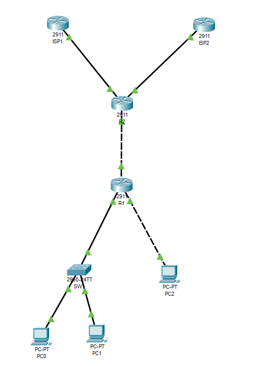
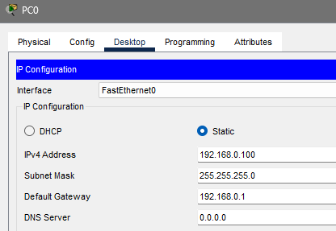
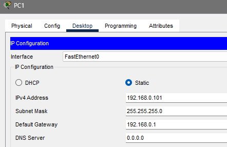
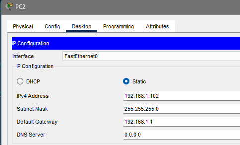
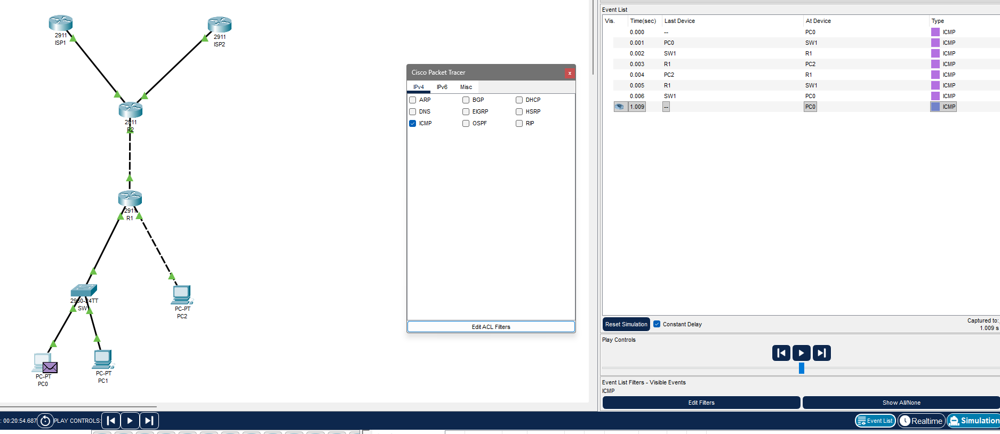
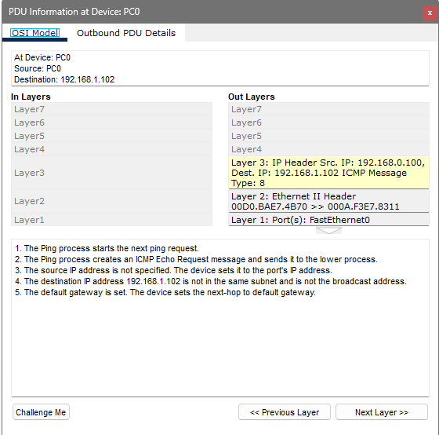
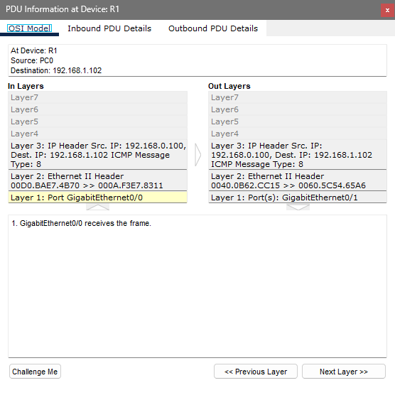
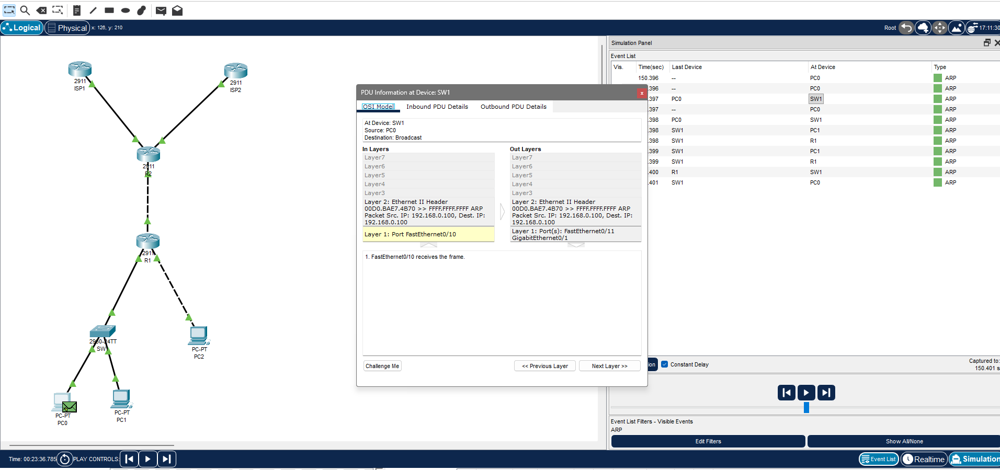
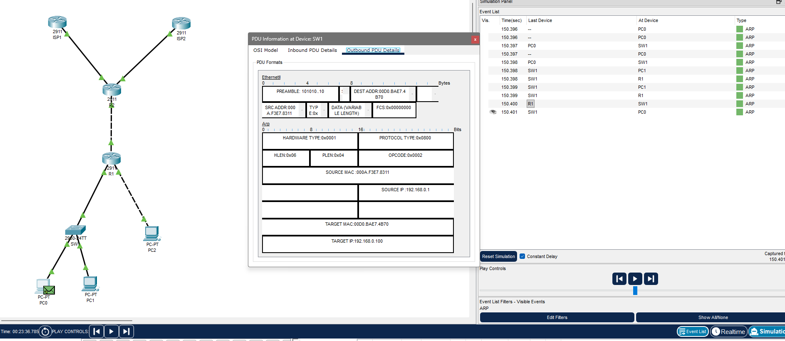

# Отчет по лабораторной работе 1.1
**Тема:** Базовая настройка, ARP, статическая маршрутизация  
**Выполнил:** Пьянов Никита 439 группа 
**Специальность:** 09.02.06 «Сетевое и системное администрирование»  

---

## Часть 1: Создание топологии и начальная конфигурация устройств

### Шаг 1

Собрал схему в Cisco Packet Tracer согласно таблице соединений: R1 подключён к SW1 (Gi0/0 ↔ Gi0/1), к PC2 (Gi0/1 ↔ Fa0) и к R2 (Gi0/2 ↔ Gi0/2). R2 подключён к ISP1 (Gi0/0) и ISP2 (Gi0/1). К SW1 подключены PC0 (F0/10) и PC1 (F0/11).



Задал статические IP-адреса, маски и шлюзы на PC0, PC1, PC2 через вкладку Desktop → IP Configuration.





Через консоль выполнил базовую настройку R1, R2 и SW1: задал hostname, отключил `ip domain-lookup`, включил шифрование паролей, установил `enable secret cisco`, создал пользователя `admin` с уровнем привилегий 15, настроил консольную линию (logging synchronous, login local, speed 115200), назначил IP-адреса и описания на интерфейсах и сохранил конфигурацию командой `write memory`.

Конфигурация R1:

```text
hostname R1
no ip domain-lookup
service password-encryption
enable secret cisco
username admin privilege 15 secret cisco
line console 0
 logging synchronous
 login local
 speed 115200
interface Gi0/0
 description LAN1
 ip address 192.168.0.1 255.255.255.0
interface Gi0/1
 description LAN2
 ip address 192.168.1.1 255.255.255.128
interface Gi0/2
 description UPLINK
 ip address 10.10.12.2 255.255.255.252
```

Конфигурация R2:

```text
hostname R2
no ip domain-lookup
service password-encryption
enable secret cisco
username admin privilege 15 secret cisco
line console 0
 logging synchronous
 login local
 speed 115200
interface Gi0/0
 description ISP1
 ip address 100.0.102.130 255.255.255.252
interface Gi0/1
 description ISP2
 ip address 100.0.202.130 255.255.255.252
interface Gi0/2
 description DOWNLINK
 ip address 10.10.12.1 255.255.255.252
```

Конфигурация SW1:

```text
hostname SW1
no ip domain-lookup
service password-encryption
enable secret cisco
username admin privilege 15 secret cisco
line console 0
 logging synchronous
 login local
 speed 115200
interface vlan 1
 description MGMT
 ip address 192.168.0.254 255.255.255.0
ip default-gateway 192.168.0.1
```

### Шаг 2

Проверил связность с PC0 командами `ping` до PC1 и PC2.

```text
C:\>ping 192.168.0.101

Pinging 192.168.0.101 with 32 bytes of data:

Reply from 192.168.0.101: bytes=32 time<1ms TTL=128
Reply from 192.168.0.101: bytes=32 time<1ms TTL=128
Reply from 192.168.0.101: bytes=32 time<1ms TTL=128
Reply from 192.168.0.101: bytes=32 time<1ms TTL=128

Ping statistics for 192.168.0.101:
    Packets: Sent = 4, Received = 4, Lost = 0 (0% loss),
Approximate round trip times in milli-seconds:
    Minimum = 0ms, Maximum = 0ms, Average = 0ms

C:\>ping 192.168.1.102

Pinging 192.168.1.102 with 32 bytes of data:

Reply from 192.168.1.102: bytes=32 time<1ms TTL=127
Reply from 192.168.1.102: bytes=32 time<1ms TTL=127
Reply from 192.168.1.102: bytes=32 time<1ms TTL=127
Reply from 192.168.1.102: bytes=32 time=4ms TTL=127

Ping statistics for 192.168.1.102:
    Packets: Sent = 4, Received = 4, Lost = 0 (0% loss),
Approximate round trip times in milli-seconds:
    Minimum = 0ms, Maximum = 4ms, Average = 1ms
```

Таблица коммутации SW1:

```text
SW1# show mac address-table
          Mac Address Table
-------------------------------------------

Vlan    Mac Address       Type        Ports
----    -----------       --------    -----
   1    000a.f3e7.8311    DYNAMIC     Gig0/1
   1    000c.cfe2.5a42    DYNAMIC     Fa0/11
   1    00d0.bae7.4b70    DYNAMIC     Fa0/10
```

Таблица ARP на PC0:

```text
C:\>arp -a
  Internet Address      Physical Address      Type
  192.168.0.1           000a.f3e7.8311         dynamic
  192.168.0.101         000c.cfe2.5a42         dynamic
```

Таблица ARP на R1:

```text
R1# show arp
Protocol  Address          Age (min)  Hardware Addr   Type   Interface
Internet  10.10.12.2              -   0060.3E5A.2E91  ARPA   GigabitEthernet0/2
Internet  192.168.0.1             -   -               ARPA   GigabitEthernet0/0
Internet  192.168.0.100          10   00D0.BAE7.4B70  ARPA   GigabitEthernet0/0
Internet  192.168.1.1             -   -               ARPA   GigabitEthernet0/1
Internet  192.168.1.102           2   0060.5C54.65AE  ARPA   GigabitEthernet0/1
```

**Ответы на вопросы:**

1. **Эхо-запросы проходят успешно?**  
   Да, оба пинга прошли без потерь (`Lost = 0 (0% loss)`). Пинг до PC1 имеет TTL=128, так как PC1 находится в той же подсети `192.168.0.0/24` — трафик идёт напрямую через SW1 без участия маршрутизатора. Пинг до PC2 имеет TTL=127, так как PC2 в другой подсети `192.168.1.0/25` — пакет проходит через маршрутизатор R1, где TTL уменьшается на 1.

2. **Как выглядит таблица коммутации на SW1?**  
   В таблице три динамические записи: MAC-адрес R1 (`000a.f3e7.8311`, порт Gi0/1), MAC-адрес PC1 (`000c.cfe2.5a42`, порт Fa0/11) и MAC-адрес PC0 (`00d0.bae7.4b70`, порт Fa0/10). MAC-адрес PC2 в таблице отсутствует, потому что весь трафик к PC2 идёт через R1 — на втором уровне источником/получателем кадров является MAC маршрутизатора, а не PC2.

3. **Как выглядит таблица ARP на PC0? На R1?**  
   На PC0 две записи: `192.168.0.1` (шлюз R1) и `192.168.0.101` (PC1) — обе в одной подсети с PC0. Записи для PC2 нет, так как PC2 в другой подсети, и PC0 отправляет весь трафик к нему на MAC шлюза, а не напрямую.  
   На R1 — записи для всех устройств, с которыми он обменивался трафиком: PC0 (`192.168.0.100`), PC2 (`192.168.1.102`) и R2 (`10.10.12.2`). Собственные адреса R1 (`192.168.0.1`, `192.168.1.1`) отмечены без Hardware Addr.

---

## Часть 2: Роль IP и MAC адреса при прямой и косвенной пересылке

### Шаг 1

Перешёл в режим симуляции (Simulation), в фильтрах оставил только протокол ICMP и отправил с PC0 команду `ping 192.168.1.102`.



### Шаг 2

Открыл первое событие на PC0 (Source = PC0, Destination = 192.168.1.102) и изучил заголовки во вкладке Outbound PDU Details.



В блоке Ethernet:
- SRC MAC = `000D.BAE7.4B70` — MAC-адрес PC0;
- DEST MAC = `000A.F3E7.8311` — MAC-адрес R1 (шлюза по умолчанию).

* **DEST MAC:** в поле DEST MAC Ethernet-кадра указан MAC-адрес **маршрутизатора R1** (Gi0/0, `000A.F3E7.8311`), а не конечного получателя PC2. Это объясняется тем, что PC2 находится **в другой подсети** (`192.168.1.0/25`), поэтому применяется **косвенная пересылка**: хост отправляет кадр не конечному получателю, а своему шлюзу по умолчанию. Это подтверждается пояснением в окне PDU: *«The destination IP address 192.168.1.102 is not in the same subnet... The device sets the next-hop to default gateway»*.

Пролистал симуляцию до момента, когда пакет достиг R1, и посмотрел Outbound PDU Details.



В блоке Ethernet:
- SRC MAC = `0040.0B62.CC15` — MAC-адрес R1 (Gi0/1);
- DEST MAC = `0060.5C54.65A6` — MAC-адрес PC2.

* **SRC и DEST MAC:** маршрутизатор R1 принял кадр от PC0, снял его L2-заголовок и сформировал новый для исходящего интерфейса Gi0/1. При этом **IP-адреса не изменились** (SRC = 192.168.0.100, DEST = 192.168.1.102), а **MAC-адреса полностью сменились**: источником стал MAC R1 (`0040.0B62.CC15`), получателем — MAC PC2 (`0060.5C54.65A6`). Это и есть суть косвенной пересылки: на каждом участке пути L2-адреса свои, а L3-адреса сквозные.

---

## Часть 3: Протокол ARP

### Шаг 1

Вышел из режима симуляции, очистил таблицу ARP на PC0 командой `arp -d`. Снова включил симуляцию, установил фильтр только на протокол ARP и отправил с PC0 команду `ping 192.168.0.1` (пинг до шлюза R1).

### Шаг 2

Открыл первое событие ARP на PC0 (тип ARP) и изучил его.



**Ответы на вопросы (ARP-запрос):**

1. **Какой TYPE указан в Ethernet-кадре?**  
   `TYPE = 0x0806` — это EtherType для протокола ARP.

2. **Какой MAC-адрес назначения указан в Ethernet-кадре? Как он называется? Как поступит коммутатор SW1, когда получит этот кадр?**  
   DEST MAC = `FFFF.FFFF.FFFF` — это **широковещательный (broadcast)** MAC-адрес. SW1, получив кадр с широковещательным MAC, выполнит **затопление (flooding)** — отправит кадр во все порты VLAN 1, кроме того, откуда он пришёл (т.е. во все порты, кроме F0/10).

3. **Какой OPCODE указан в заголовке ARP?**  
   `OPCODE = 0x0001` — код запроса (ARP Request).

4. **SOURCE MAC и SOURCE IP какого устройства указаны в заголовке ARP?**  
   SOURCE MAC = `00D0.BAE7.4B70` (PC0), SOURCE IP = `192.168.0.100` (PC0).

5. **Какой TARGET MAC? Почему?**  
   TARGET MAC = `0000.0000.0000` (нулевой). Это объясняется тем, что PC0 **ещё не знает** MAC-адрес R1 — именно для его получения и отправляется ARP-запрос. Поле TARGET MAC в запросе всегда заполняется нулями.

Пролистал события до момента, когда R1 отправил ARP-ответ, и изучил Outbound PDU Details.



**Ответы на вопросы (ARP-ответ):**

1. **MAC-адрес какого устройства указан в Ethernet-кадре? Как поступит коммутатор SW1, получив этот кадр?**  
   SRC MAC = `000A.F3E7.8311` (R1), DEST MAC = `00D0.BAE7.4B70` (PC0). Это уже **unicast-кадр**. Коммутатор SW1, изучив MAC-адрес PC0 из предыдущего ARP-запроса, отправит кадр **только в порт F0/10**, где подключён PC0. Затопления не будет.

2. **Какой OPCODE указан в заголовке ARP?**  
   `OPCODE = 0x0002` — код ответа (ARP Reply).

3. **Кому принадлежат SOURCE MAC, SOURCE IP и TARGET MAC, TARGET IP?**
   - SOURCE MAC = `000A.F3E7.8311` — R1 (Gi0/0);
   - SOURCE IP = `192.168.0.1` — R1 (Gi0/0);
   - TARGET MAC = `00D0.BAE7.4B70` — PC0;
   - TARGET IP = `192.168.0.100` — PC0.

   То есть R1 в ответе сообщает: «Я — 192.168.0.1, мой MAC — 000A.F3E7.8311», — после чего PC0 создаёт запись в ARP-таблице.

---

## Часть 4: Настройка статической маршрутизации

### Шаг 1

Вышел из режима симуляции. Выполнил настройку маршрутов.

На **R1** создал рекурсивный маршрут по умолчанию через R2:

```text
R1(config)# ip route 0.0.0.0 0.0.0.0 10.10.12.1
```

На **R2** создал агрегированный рекурсивный маршрут до сетей LAN1 и LAN2. Обе сети (`192.168.0.0/24` и `192.168.1.0/25`) можно агрегировать только в префикс `/23`, так как в третьем октете у них различается младший бит (0 и 1):

```text
R2(config)# ip route 192.168.0.0 255.255.254.0 10.10.12.2
```

На **R2** создал рекурсивный маршрут по умолчанию через ISP1:

```text
R2(config)# ip route 0.0.0.0 0.0.0.0 100.0.102.129
```

На **R2** создал рекурсивный плавающий маршрут по умолчанию через ISP2 с административной дистанцией 10:

```text
R2(config)# ip route 0.0.0.0 0.0.0.0 100.0.202.129 10
```

### Шаг 2

Отправил с PC0 эхо-запросы на адрес 8.8.8.8.

```text
C:\>ping 8.8.8.8

Pinging 8.8.8.8 with 32 bytes of data:

Reply from 8.8.8.8: bytes=32 time<1ms TTL=253
Reply from 8.8.8.8: bytes=32 time<1ms TTL=253
Reply from 8.8.8.8: bytes=32 time<1ms TTL=253
Reply from 8.8.8.8: bytes=32 time<1ms TTL=253

Ping statistics for 8.8.8.8:
    Packets: Sent = 4, Received = 4, Lost = 0 (0% loss),
```

TTL = 253 говорит о том, что пакет прошёл два маршрутизатора (255 − 2 = 253): R1 и R2, а затем был обработан Loopback-интерфейсом на ISP1, эмулирующим адрес 8.8.8.8.

Таблица маршрутизации R2 до выключения Gi0/0:

```text
R2# show ip route
Codes: L - local, C - connected, S - static, R - RIP, M - mobile, B - BGP
...
Gateway of last resort is 100.0.102.129 to network 0.0.0.0

     10.0.0.0/8 is variably subnetted, 2 subnets, 2 masks
C       10.10.12.0/30 is directly connected, GigabitEthernet0/2
L       10.10.12.1/32 is directly connected, GigabitEthernet0/2
     100.0.0.0/8 is variably subnetted, 4 subnets, 2 masks
C       100.0.102.128/30 is directly connected, GigabitEthernet0/0
L       100.0.102.130/32 is directly connected, GigabitEthernet0/0
C       100.0.202.128/30 is directly connected, GigabitEthernet0/1
L       100.0.202.130/32 is directly connected, GigabitEthernet0/1
S    192.168.0.0/23 [1/0] via 10.10.12.2
S*   0.0.0.0/0 [1/0] via 100.0.102.129
```

**Какой следующий узел указан для маршрута по умолчанию?**  
Next-hop = `100.0.102.129` — это адрес ISP1. Именно этот маршрут активен, потому что у него административная дистанция 1, а у плавающего — 10.

Выключил интерфейс Gi0/0 на R2:

```text
R2(config)# interface Gi0/0
R2(config-if)# shutdown
```

Снова посмотрел таблицу маршрутизации:

```text
R2# show ip route
...
Gateway of last resort is 100.0.202.129 to network 0.0.0.0

     10.0.0.0/8 is variably subnetted, 2 subnets, 2 masks
C       10.10.12.0/30 is directly connected, GigabitEthernet0/2
L       10.10.12.1/32 is directly connected, GigabitEthernet0/2
     100.0.0.0/8 is variably subnetted, 2 subnets, 2 masks
C       100.0.202.128/30 is directly connected, GigabitEthernet0/1
L       100.0.202.130/32 is directly connected, GigabitEthernet0/1
S    192.168.0.0/23 [1/0] via 10.10.12.2
S*   0.0.0.0/0 [10/0] via 100.0.202.129
```

**Какой следующий узел указан теперь для маршрута по умолчанию?**  
Next-hop изменился на `100.0.202.129` — это адрес ISP2. Сработал **плавающий маршрут** с административной дистанцией 10: как только основной маршрут через ISP1 стал недоступен (интерфейс Gi0/0 выключен), маршрутизатор автоматически переключился на резервный путь.

После проверки включил интерфейс Gi0/0 обратно:

```text
R2(config)# interface Gi0/0
R2(config-if)# no shutdown
```

---

## Вывод

В ходе лабораторной работы я изучил принципы построения локальных сетей на оборудовании Cisco и освоил базовую настройку маршрутизаторов и коммутаторов: задание hostname, паролей, консольного доступа, IP-адресации и описаний интерфейсов. Разобрал разницу между прямой и косвенной пересылкой пакетов: при косвенной пересылке MAC-адреса меняются на каждом участке пути, а IP-адреса остаются сквозными — это наглядно видно в режиме симуляции Packet Tracer. Изучил работу протокола ARP: механизм формирования широковещательного запроса (OPCODE = 1) и unicast-ответа (OPCODE = 2), а также принцип заполнения таблицы ARP. Освоил настройку статической маршрутизации: рекурсивный маршрут по умолчанию, агрегированный маршрут (с использованием максимально узкой маски /23), а также плавающий маршрут с изменённой административной дистанцией. На практике убедился в работе резервирования: при отключении основного интерфейса Gi0/0 на R2 трафик автоматически пошёл через резервный маршрут через ISP2.